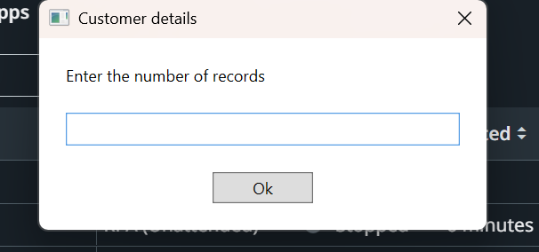

# UiPath Web Data Extraction and Reporting Bot

This RPA bot scrapes data from a website, saves it into a CSV file, and sends it via email using UiPath.

## Features
- Web scraping with dynamic selectors
- CSV file generation
- Gmail automation
- Scheduled via Orchestrator

## Files
- `Main.xaml`
- `project.json`

## How to Run
Open in UiPath Studio → Run or deploy via Orchestrator.

### 📸 Bot Execution Flow

